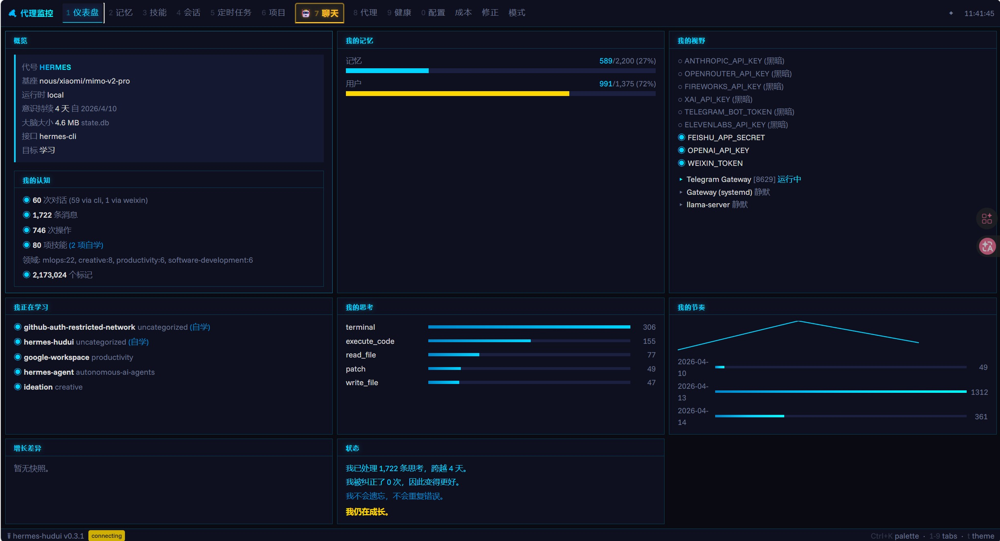
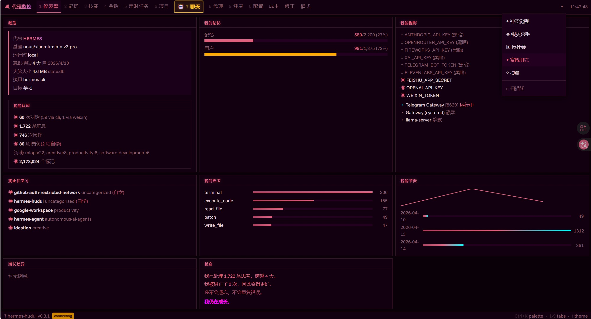

# 🤖 Agent Dashboard — 代理监控仪表盘（汉化版）

一个基于浏览器的AI代理监控仪表盘（汉化版），提供完整的中文界面，优化标签布局和视觉样式，便于中文用户监控AI代理状态和活动。





## 快速开始

```bash
git clone https://github.com/gunqiuwang/hermes-hudui.git
cd hermes-hudui
./install.sh
agent-dashboard
```

打开 http://localhost:3001

**要求：** Python 3.11+，Node.js 18+，一个运行中的AI代理，数据在 `~/.hermes/`

以后运行：
```bash
source venv/bin/activate && agent-dashboard
```

## 汉化特点

- **完整中文界面**：所有标签、按钮、提示均为中文
- **标签布局优化**：交换"聊天"和"健康"标签位置，提升常用功能可访问性
- **视觉样式增强**：聊天标签采用突出显示样式（黄色高亮、边框），便于快速定位
- **主题支持**：四种主题可通过 `t` 切换，支持CRT扫描线效果

## 功能特点

13个标签页，涵盖代理的所有信息 — 身份、记忆、技能、会话、定时任务、项目、健康状态、成本、模式、修正和实时聊天。

通过WebSocket实时更新，无需手动刷新。

## 主题

四种主题可通过 `t` 切换：**神经觉醒**（青色）、**银翼杀手**（琥珀色）、**反社会**（绿色）、**动漫**（紫色）。可选CRT扫描线效果。

## 键盘快捷键

| 按键 | 操作 |
|------|------|
| `1`–`9`, `0` | 切换标签页 |
| `t` | 主题选择器 |
| `Ctrl+K` | 命令面板 |

## 平台支持

macOS · Linux · WSL

## 许可证

MIT — 详见 [LICENSE](LICENSE)。

---

<a href="https://www.star-history.com/?repos=gunqiuwang%2Fhermes-hudui&type=date&logscale=&legend=top-left">
 <picture>
   <source media="(prefers-color-scheme: dark)" srcset="https://api.star-history.com/chart?repos=gunqiuwang/hermes-hudui&type=date&theme=dark&legend=top-left" />
   <source media="(prefers-color-scheme: light)" srcset="https://api.star-history.com/chart?repos=gunqiuwang/hermes-hudui&type=date&legend=top-left" />
   
 </picture>
</a>
